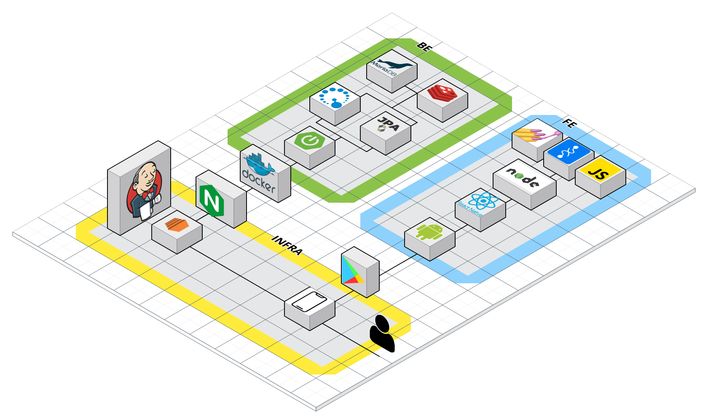
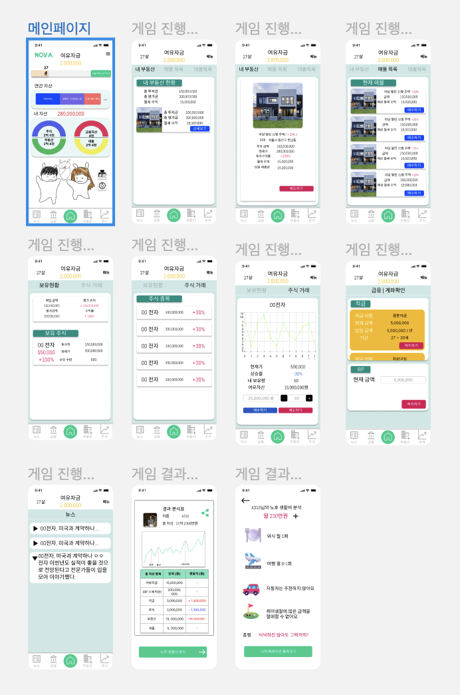
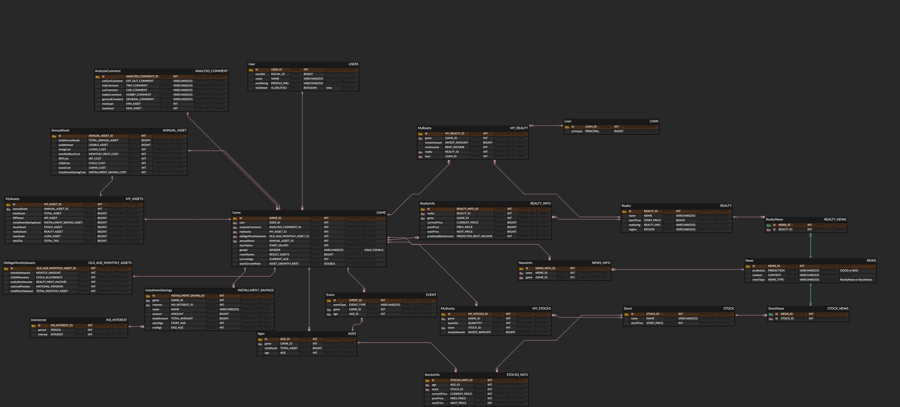

## NOVA : 노후를 바로잡다 🍀
  금융 이해력이 낮은 20대 들을 위한 “노후 준비 + 자산관리 교육” 서비스.  
  취업나이를 27로 설정하여 27세부터 60세까지 자산운용 시뮬레이션을 하고 노후에 어느정도의
  재산을 쌓을 수 있을지 측정해본다.

  
## 목차 🥇
- [목표와 기능](#1목표와-기능-)
- [개발 환경 및 배포 URL](#2개발-환경-및-배포-URL-)
- [프로젝트 구조와 개발 일정](#3프로젝트-구조와-개발-일정-)
- [역할 분담](#4역할-분담-)
- [UI/BM](#5uibm-)
- [데이터베이스 모델링(ERD)](#6-데이터베이스-모델링-erd-)
- [메인 기능](#6-메인-기능-)
- [추가할 기능](#7-추가할-기능-)

## 1.목표와 기능 ✈
### 1.1 목표
  - 나만의 공연 리뷰 기록 앱
  - 공연 정보를 찾아보고 계획을 세우는 캘린더 역할
  - 공연 후기를 저장해 나의 추억을 저장하는 공간
  
### 1.2 기능
  - 매년 해마다 갱신되는 뉴스
  - 매년 해마다 바뀌는 주식과 부동산 가격
  - 주식과 부동산을 통한 투자
  - 적금과 IRP를 통한 저축
  - 결혼과 출산 이벤트 

---
## 2.개발 환경 및 배포 URL 🏠 

### 2.1 개발 환경

  UI 디자인
    - figma   
  Backend
    - IntelliJ & java17   
  Frontend
    - React Native  
  서비스 배포 환경
    - Aws Ec2 & 도커 & 젠킨스 ci/cd

### 2.2 배포 URL
  백엔드 : sehbeomschool-nova.site    
  프론트 : 

---
## 3.프로젝트 구조와 개발 일정 ⏲

### 3.1 프로젝트 구조 (아키텍쳐)

### 3.2 개발 일정
- 기간: 2023.08. ~ 2023.10.6

---
## 4.역할 분담 🧑‍🤝‍🧑
  - 팀장 & Back : 장세범
  - Back & 데이터 : 임대영
  - Back & 인프라 : 임정현
  - Front : 김연재
  - Front : 김의준
  - Front : 신석철

## 5.UI/BM 🖼

figma : https://www.figma.com/file/7EMIKPTnUGh0gHpKC9VUAu/Untitled?type=design&node-id=597%3A711&mode=design&t=YYxW2eNYvBdu4H5B-1

## 6. 데이터베이스 모델링 ERD 🏗
  - 

## 6. 메인 기능 🌟 
  - 27세부터 60세까지 1년 단위로 주식투자, 부동산 투자, 적금 가입, IRP 납입, 결혼, 출산 등 다양한 경제활동을 체험

## 7. 추가할 기능 ➕ 
  - 카카오 로그인 외 소셜 로그인 (구글, 네이버 등)
  - 그 외 필요한 것이 생기면 추가 예정.

